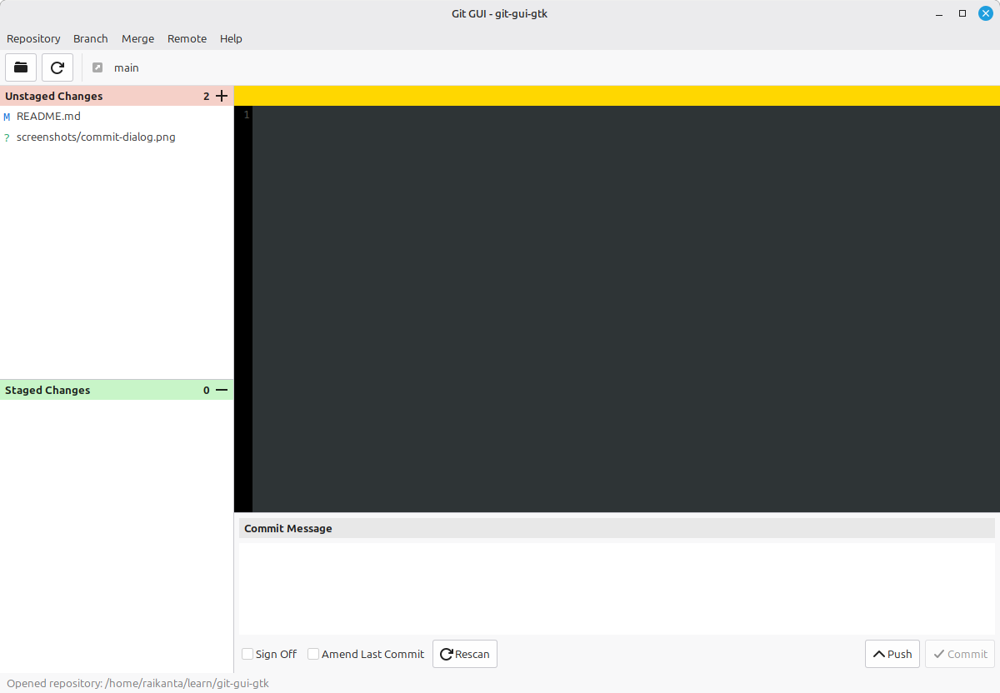
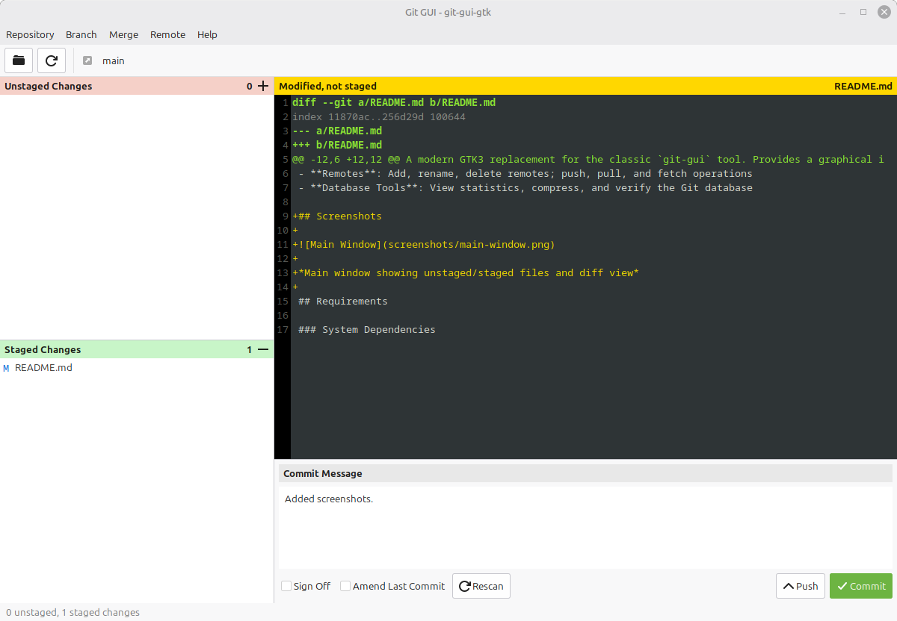
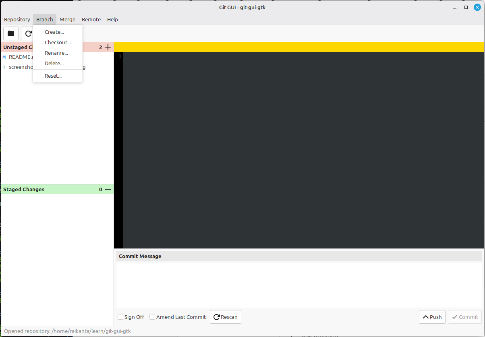

# Git GUI GTK

A modern GTK3 replacement for the classic `git-gui` tool. Provides a graphical interface for common Git operations with a clean, native look on Linux desktops.

## Features

- **Repository Status View**: See unstaged and staged changes at a glance
- **Diff Viewer**: View file diffs with syntax highlighting and adjustable context lines
- **Staging**: Stage/unstage individual files or all changes
- **Partial Staging**: Stage or unstage individual hunks or even single lines via right-click context menu
- **Partial Reverting**: Revert individual hunks or lines to discard specific changes
- **Commits**: Create commits with messages, amend previous commits, sign-off support
- **Branches**: Create, checkout, rename, delete, reset branches with multiple options
- **Merge**: Merge branches with strategy options (default, no-ff, ff-only, squash)
- **Rebase**: Rebase current branch onto local branches, tracking branches, or tags
- **Remotes**: Add, rename, delete remotes; push, pull, and fetch operations
- **Database Tools**: View statistics, compress, and verify the Git database

## Screenshots



*Main window showing unstaged/staged files and diff view*



*Commit message*



*The Branch Menu*

## Requirements

This application is designed to run with your system Python and system packages. No virtual environment or conda is required.

### Debian/Ubuntu

```bash
sudo apt install python3 python3-gi python3-gi-cairo gir1.2-gtk-3.0 gir1.2-gtksource-4 python3-git
```

### Fedora

```bash
sudo dnf install python3 python3-gobject gtk3 gtksourceview4 python3-GitPython
```

### Arch Linux

```bash
sudo pacman -S python python-gobject gtk3 gtksourceview4 python-gitpython
```

## Installation

1. Install system dependencies (see Requirements above)

2. Clone the repository:

   ```bash
   git clone https://github.com/raikantasahu/git-gui-gtk.git
   cd git-gui-gtk
   ```

3. Run the application:

   ```bash
   ./main.py
   ```

## Usage

### Opening a Repository

Run from within a Git repository:

```bash
cd /path/to/your/repo
/path/to/git-gui-gtk/main.py
```

Or open a repository via the menu: **Repository > Open...**

### Basic Workflow

1. **View Changes**: Unstaged and staged files appear in the left panel
2. **View Diff**: Click a file to see its diff in the right panel
3. **Stage Files**: Double-click a file or use the context menu to stage/unstage
4. **Commit**: Enter a commit message and click Commit

### Diff View Context Menu

Right-click in the diff view to access these options:

- **Stage Hunk for Commit** / **Unstage Hunk from Commit**: Stage or unstage the entire hunk at the cursor position
- **Stage Line for Commit** / **Unstage Line from Commit**: Stage or unstage just the single line at the cursor position
- **Revert Hunk**: Discard all changes in the hunk (cannot be undone)
- **Revert Line**: Discard just the single line change (cannot be undone)
- **Show More Context**: Increase context lines shown in diff by 3
- **Show Less Context**: Decrease context lines shown in diff by 3

Note: Stage/unstage and revert options are only available for tracked files with changes.

### Keyboard Shortcuts

- `Ctrl+O` - Open repository
- `F5 or Ctrl+R` - Rescan/refresh
- `Ctrl+Q` - Quit

## Project Structure

```
git-gui-gtk/
├── main.py              # Application entry point
├── application.py       # GtkApplication class
├── window.py            # Main window
├── actions.py           # Menu and keyboard actions
├── config.py            # UI configuration
├── utils.py             # Utility functions
├── gitops/              # Git operations (one function per file)
├── dialogs/             # Dialog windows
├── widgets/             # Custom GTK widgets
│   ├── file_list.py     # Staged/unstaged file lists
│   ├── diff_view.py     # Diff viewer with syntax highlighting
│   └── commit_area.py   # Commit message and buttons
└── icons/               # Application icons
```

## License

This project is licensed under the MIT License - see the [LICENSE](LICENSE) file for details.
